# Бинаризация документов

В данном репозитории представлен набор алгоритмов бинаризации изображений: Otsu, Otsu для двух
несбалансированных классов, Niblack, адаптивный Niblack), а также метрика PSNR (Peak Signal-to-Noise Ratio) 
для замера качества работы.

### Инструкция по запуску

Скрипт имеет 5 обязательных параметров:

1) -i путь к папке с изображениями
2) -o путь к папке сохранения результата
3) -w размер окна для Ниблэка
4) -a параметра alpha (коэффициент перед std) для Ниблэка
5) -s параметр sigma0 (минимальный порог для std) для адаптивного Ниблэка

И 3 необязательных:

1) --test True - провести тестирование (False - не проводить)
2) --test_i -i путь к папке с изображениями для тестирования
3) --test_l -i путь к папке с разметкой для тестирования

Пример скрипта:

  ```
  python3 main.py -i <input_dir> -o <output_dir> -w 71 -a -1 -s 0.2 --test True --test_i <input_dir> --test_l <output_dir>
  ```

### PSNR

Метрика PSNR обычно используется для измерения качества
восстановленного изображения по сравнению с оригинальным изображением, чем выше значение
PSNR, тем лучше качество восстановленного изображения. По ней можно понять общее структурнное
различие картинок.

### Датасет

Для проверки качества работы алгоритмов был взять датасет DIBCO2019, 
состоящий из 10 изображений разного качества рукописных и печтных текстов 
на разных языках

### О алгоритмах бинаризации

**Otsu** классический глобальный метод бинаризации. Он основывается на использовании
гистограммы яркости пикселей и пытается найти пороговое значение, которое разделяет пиксели на два класса: переднего
плана (объекты интереса) и фона (фоновые пиксели).

Основные шаги алгоритма:

1) Вычисление гистограммы яркости изображения.
2) Нормализация гистограммы, чтобы получить вероятности
для каждого уровня яркости.
3) Вычисление общей дисперсии внутриклассового разброса
для всех возможных пороговых значений.
4) Выбор порога, при котором дисперсия внутриклассового разброса минимальна.

Недостатки алгоритма:

Алгоритм предполагает, что изображение состоит из двух сбалансированных 
классов пикселей (фон и объекты), и он не всегда хорошо
справляется с бинаризацией изображений, содержащих большое
количество шума, имеющих сложные фоны или перемены в яркости изображения.
Поэтому алгоритм может выбрать неправильный порог,
что может привести к неправильной сегментации изображения.

Преимущества алгоритма:

Является простым, эффективный в случаях однородных изображений и 
не требует предварительной настройки параметров.
<table>
  <tr>
    <td>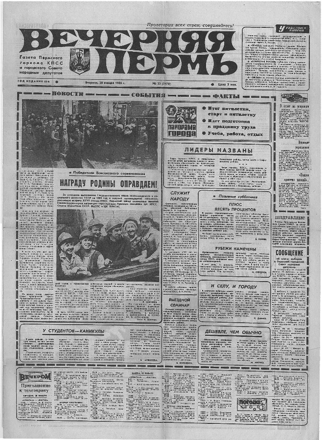</td>
    <td>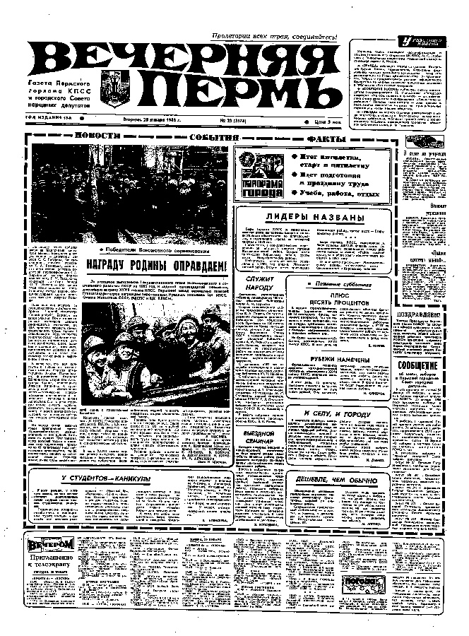</td>
  </tr>
</table>
<table>
  <tr>
    <td>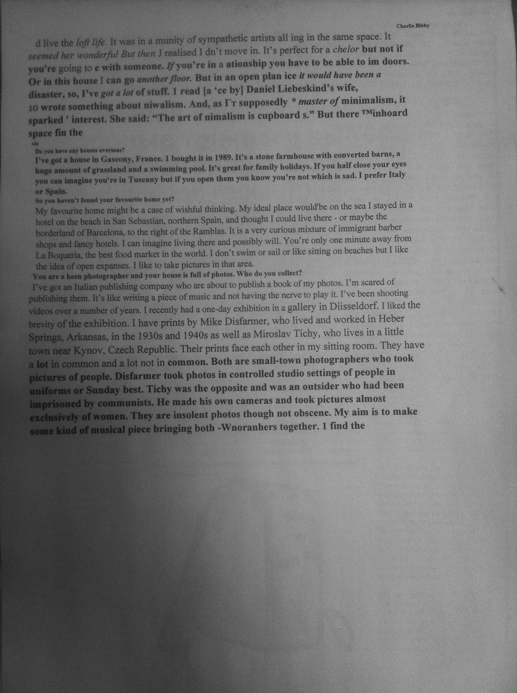</td>
    <td>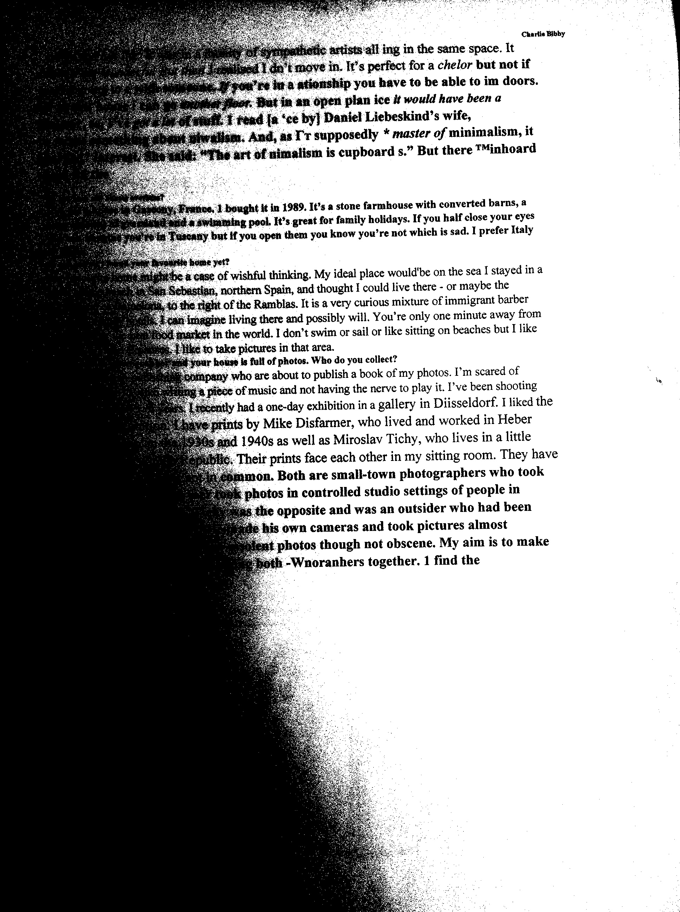</td>
  </tr>
</table>

**Модификация критерия Otsu для неравновесного случая**, 
описанная в статье "Maximum likelihood thresholding based on 
population mixture models", направлена на улучшение алгоритма Otsu
для случаев, когда классы пикселей на изображении
могут быть неравномерно представлены.

Основные шаги алгоритма:

1) Разделить гистограмму изображения на две группы: переднего и заднего плана.
2) Оценить параметры каждой группы с помощью метода максимального правдоподобия, используя модель смеси распределений Гаусса (Gaussian mixture model). Параметры, которые необходимо оценить, включают средние значения и дисперсии каждой группы.
3) Рассчитать функцию правдоподобия для каждой из двух групп.
4) Рассчитать сумму функций правдоподобия для двух групп и использовать ее в качестве критерия определения порога бинаризации.
5) Найти порог бинаризации, который максимизирует критерий, определенный на шаге 4.

Преимуществом модификации является то, что она позволяет более точно 
определить пороги для каждого класса в случае несбалансированных классов.
Она может быть более устойчивой к вариациям освещения
и контрастности изображений. Но главныным недостатком остается то, что
порог глобален для всего изображения.

<table>
  <tr>
    <td>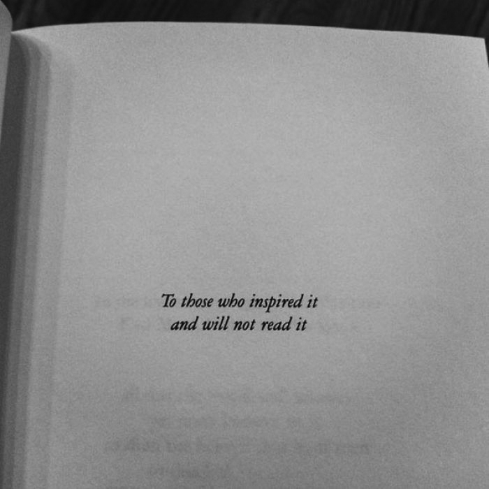</td>
    <td>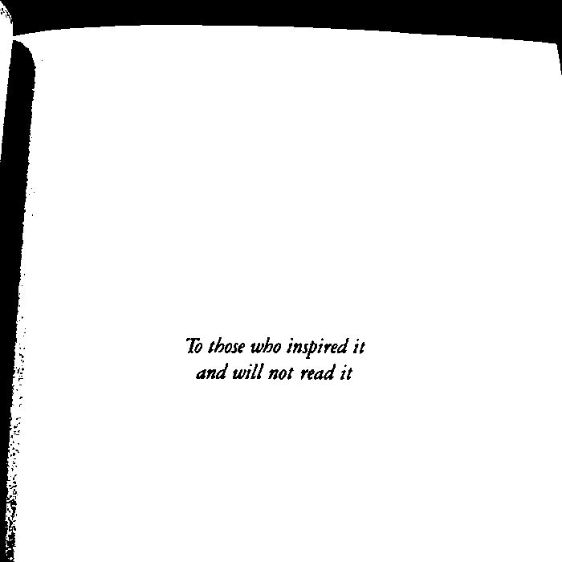</td>
  </tr>
</table>
<table>
  <tr>
    <td>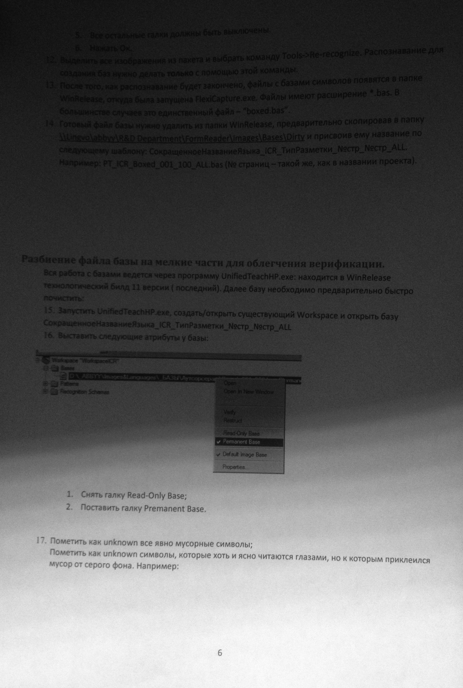</td>
    <td>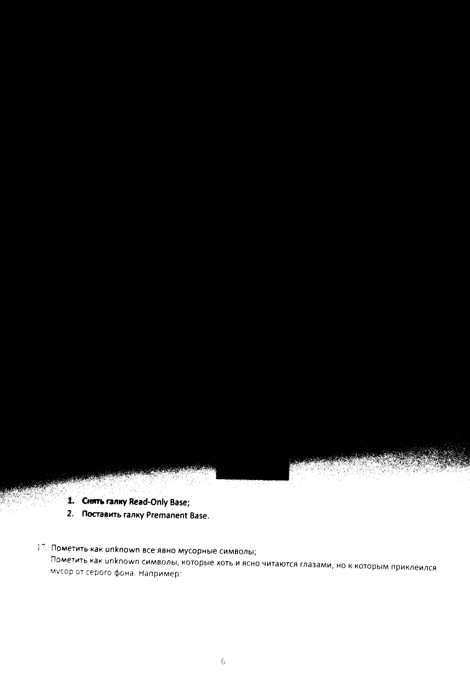</td>
  </tr>
</table>

***Локальный метода бинаризации Niblack*** описанный в Niblack W. An Introduction to Digital Image Processing 
основан на вычислении порога для каждого пикселя в изображении на 
основе его локального контекста. Контекст определяется окном заданного размера,
расположенным вокруг каждого пикселя.

Основные шаги алгоритма:

1) Разбить изображение на неперекрывающиеся блоки заданного размера.
2) Вычислить среднее значение и стандартное отклонение интенсивности пикселей в каждом блоке.
3) Для каждого пикселя вычислить пороговое значение по формуле:

        T(x, y) = mean(x, y) + alpha * std(x, y)

        где mean(x, y) - среднее значение интенсивности в окне точки (x, y),
        std(x, y) - стандартное отклонение интенсивности в окне точки (x, y),
        alpha - коэффициент, задающийся экспериментально и может принимать значения от -1 до 1. 


Преимущества метода:

Учет локальной информации: Метод Ниблэка учитывает локальную информацию
вокруг каждого пикселя при определении порога.

Устойчивость к вариации освещения: За счет учета локального контраста, пороговое значение адаптируется
к изменениям яркости и освещения, что позволяет достичь лучшей бинаризации.

Гибкая настройка параметров, позволяет настраивать под конкретное изображения.

Недостатки метода это: 

Зависимость от выбора параметров, неправильный выбор параметров
может привести к недостаточно точной или слишком агрессивной сегментации.

Ограниченная применимость к различным типам изображений:Для изображений с низким контрастом или  сложной текстурой, метод Ниблэка может давать недостаточно т
очные результаты.

Вычислительная сложность: метод
Ниблэка вычислительно более сложным по сравнению с глобальными методами
бинаризации.
<table>
  <tr>
    <td>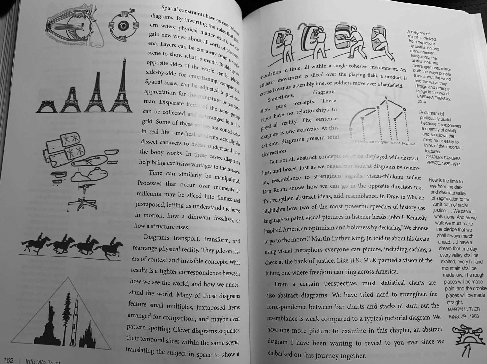</td>
    <td>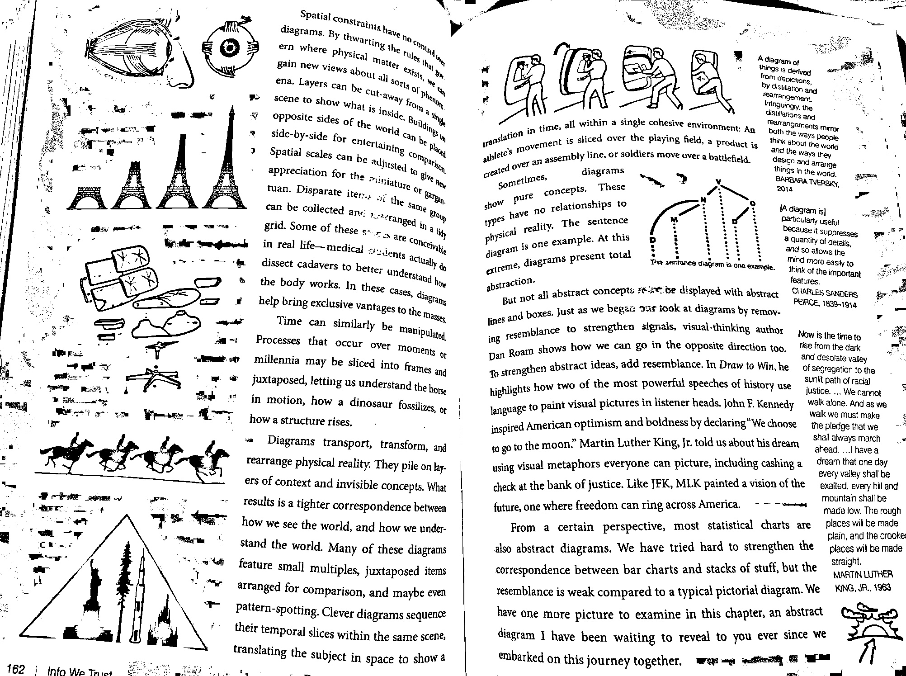</td>
  </tr>
</table>
<table>
  <tr>
    <td>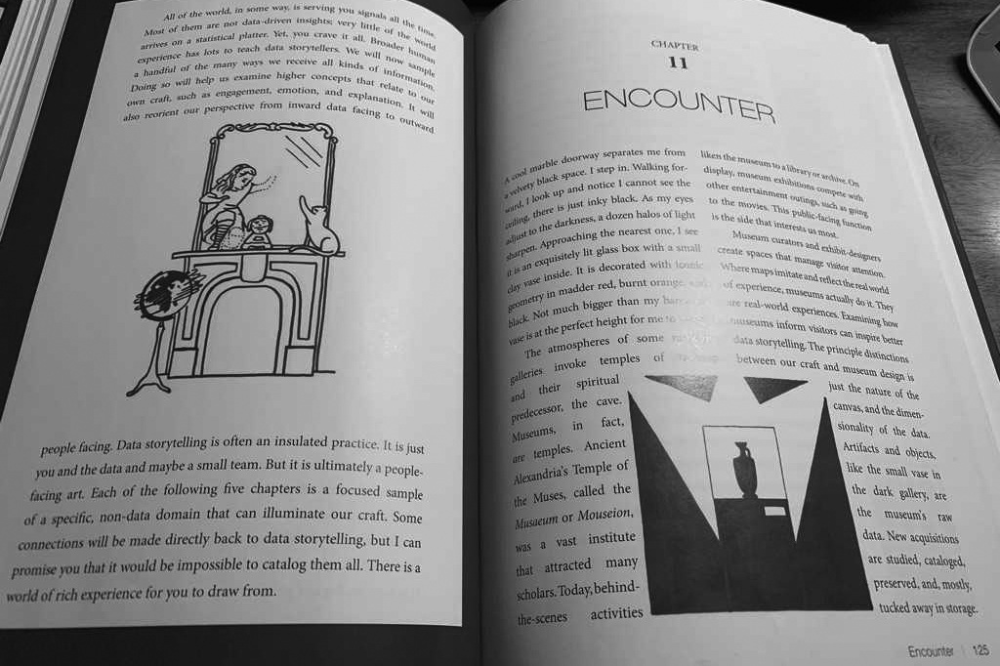</td>
    <td>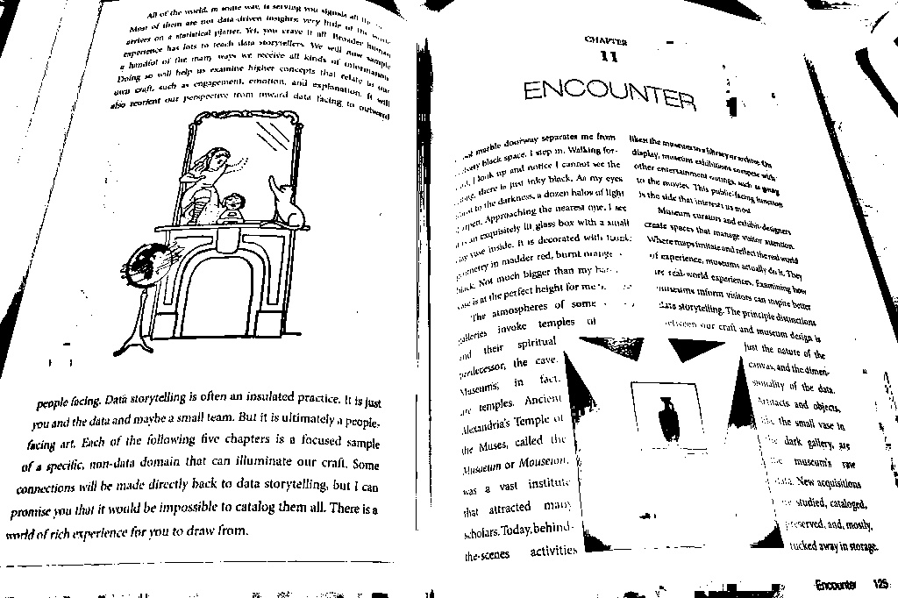</td>
  </tr>
</table>
**Локальный Adaptive Multi-scale Niblack метод** учитывает
многомасштабную информацию вокруг каждого пикселя для определения порог. 
Что позволяет более точно бинарзовывать изображение. Главным минусом является 
увеличеная вычислительная сложность.

Основные шаги:

1) Разбить изображение на несколько масштабов, используя метод пирамиды изображений (image pyramids).
2) Для каждого масштаба вычислить пороговое значение по методу Ниблэка. 
3) Для каждого пикселя выбрать наилучший порог из всех вычисленных 
на различных масштабах.
4) Применить полученный порог к каждому пикселю в изображении, чтобы получить бинаризованное изображение
<table>
  <tr>
    <td>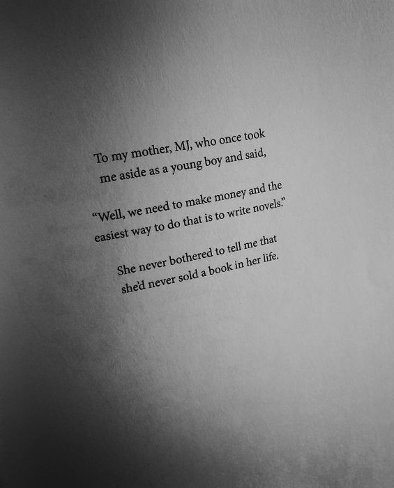</td>
    <td>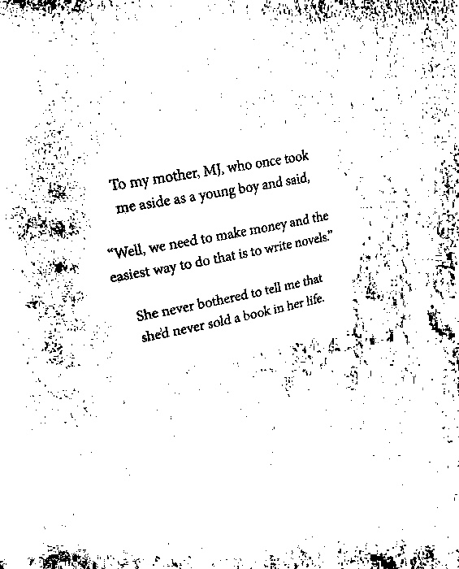</td>
  </tr>
</table>
<table>
  <tr>
    <td></td>
    <td>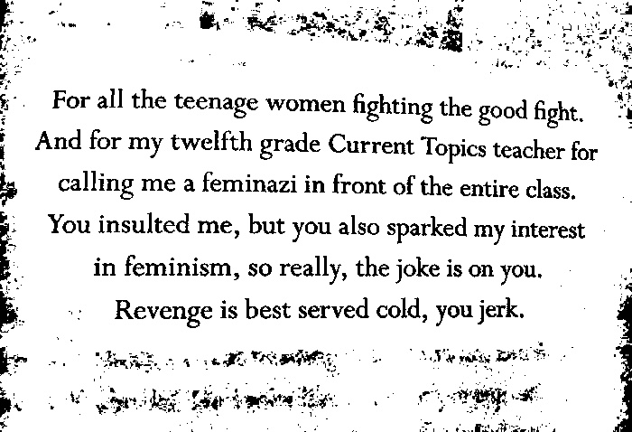</td>
  </tr>
</table>
